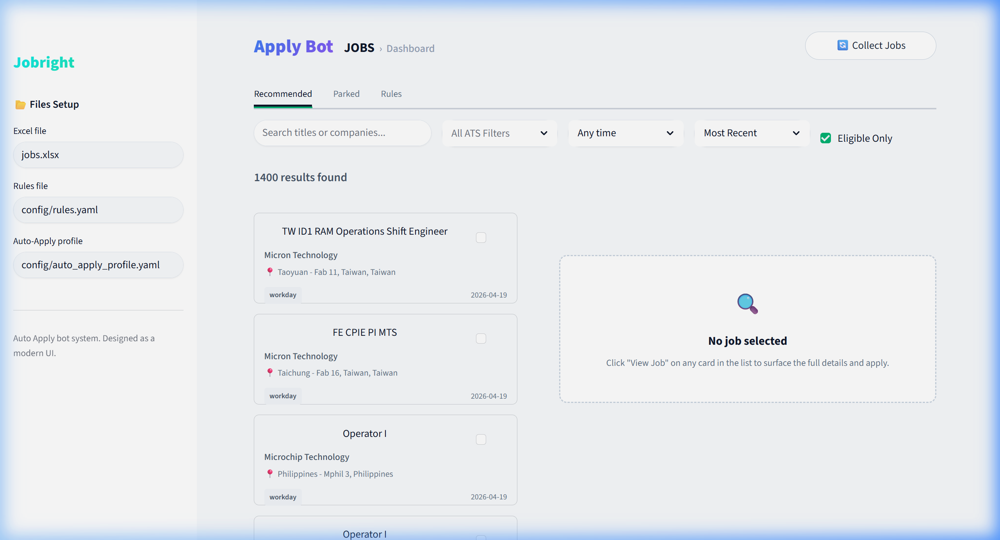
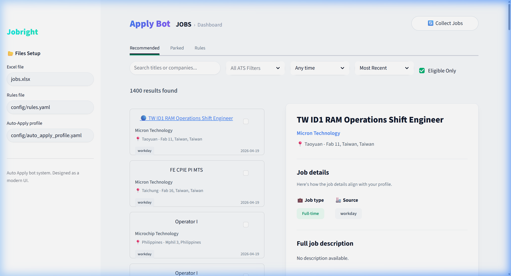

# 🤖 Apply Bot

**Welcome to Apply Bot!** This is your personal, AI-powered command center designed to completely automate the most tedious parts of job hunting. Say goodbye to manually filling out endless corporate application forms!

Apply Bot aggregates job listings from multiple ATS platforms and gives you a single, beautiful dashboard to review them. Once you've found the roles you like, simply select them and let the AI instantly navigate the portals and fill out the forms on your behalf using your own custom resume configuration.

## 🌟 What can Apply Bot do for you?

- **Browse Faster:** Flip through aggregated jobs in a clean, master-detail dashboard built just for speed and readability.
- **Set Up Your Profile Once:** Tell Apply Bot about your education, work history, and standard questionnaire answers in one simple configuration file (`candidates.yaml`).
- **AI Form Filling (`AnswerEngine`):** Never fill out a generic DEI or screening question manually again. Apply Bot dynamically reads form fields on target websites (like Workday, Lever, and Greenhouse) and makes intelligent choices based on your profile!
- **Bulk Applications:** Select multiple jobs from your queue and securely dispatch headless bots to auto-apply in the background.

## 🖼️ Dashboard Preview

Take a quick look at your powerful new dashboard layout:

### Main Queue View
Easily scan aggregated roles with the simplified queue layout, powered natively by Streamlit.


### Expanded Job Details
Read deep metadata before deciding to apply using the split-pane viewer.


---

## 🚀 Getting Started

Follow these incredibly simple steps to get Apply Bot fully operational on your machine!

### 1. Prerequisites
Before running Apply Bot, make sure you have installed:
- Python 3.9+
- The Google Chrome browser (for the automated headless scraper)

### 2. Download and Setup
Open your terminal and grab the code:
```bash
git clone https://github.com/amogh0109/Job-Application-assistant.git
cd "Job-Application-assistant"
```

Set up your virtual environment so you don't mess with system packages:
```bash
python -m venv venv
# On Windows, activate with:
venv\Scripts\activate
# On Mac/Linux, activate with:
source venv/bin/activate
```

Now, just install exactly what the bot needs to run:
```bash
pip install -r requirements.txt
playwright install chromium
```

### 3. Customize Your AI Resume Configuration!
Before you kick off the bot, you need to tell it about yourself. Open the `candidates.yaml` file in your favorite text editor. Simply fill in your details (like job history, education, basic demographic info, and standard answers) exactly how you'd want them answered on any standard application! The `AnswerEngine` uses this exact configuration to adapt natively to unpredictable forms!

### 4. Fire Up the Dashboard!
Start taking back your time by launching the UI dashboard directly:
```bash
streamlit run ui/dashboard.py
```
This will open up your very own local `http://localhost:8501` web page. From here, click "**🔄 Collect Jobs**" to scrape your latest preset roles, tick the ones that match your profile, and let the Apply Bot do exactly what it's named for!

Happy applying!
